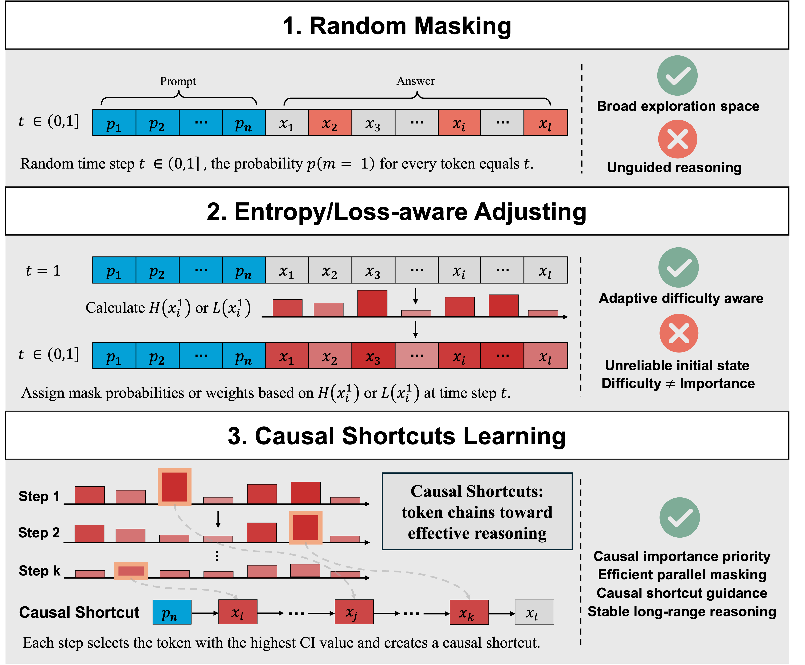
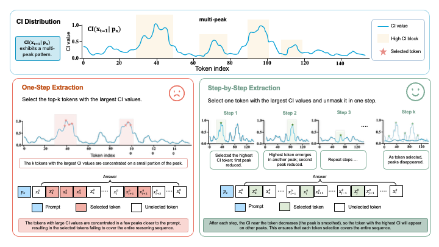
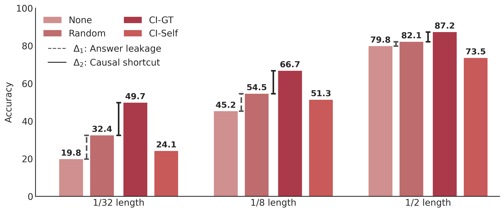
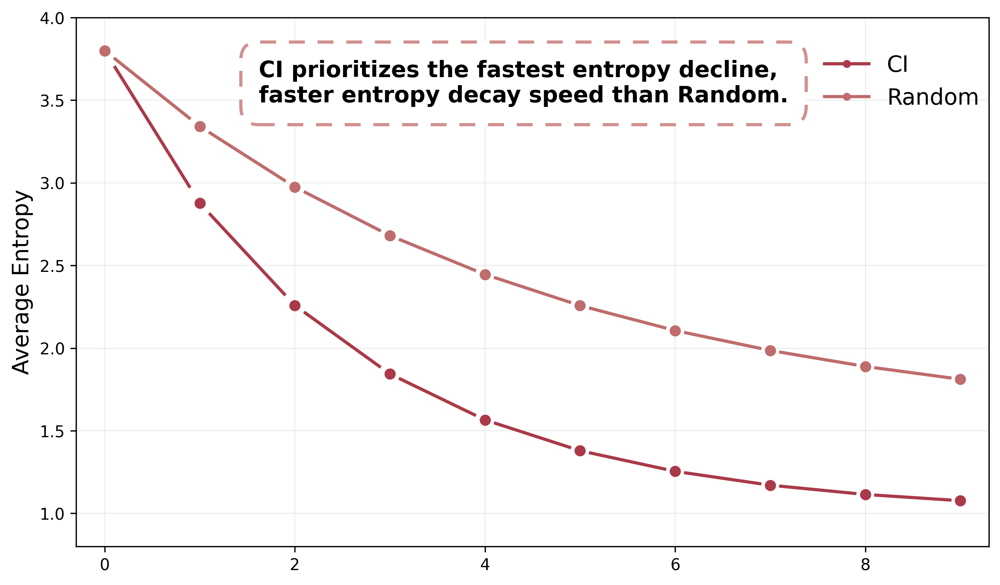

# Towards Efficient Reasoning: Learning Causal Shortcuts for Diffusion Language Models

This repository contains the official implementation for the paper "Towards Efficient Reasoning: Learning Causal Shortcuts for Diffusion Language Models".

---

## Abstract

Diffusion Language Models (DLMs) have attracted significant attention for their strong reasoning ability. However, under a bidirectional attention mechanism, DLMs operate over an exponentially large exploration space compared to autoregressive models (ARMs), making it challenging to identify effective reasoning trajectories under random masking. We define causal shortcuts as token chains that cover entire sequences and provide strong guidance toward correct reasoning trajectories. Further, we use Causal Importance (CI) to quantify this reasoning influence, computed as each token's contribution to the entropy reduction of other tokens. In experiments, we find that using causal shortcuts as prompts enables DLMs to efficiently and correctly generate full-length answers. Motivated by this finding, we propose a Causal Shortcut Learning (CSL) framework for DLMs. Specifically, we introduce a step-by-step token extraction procedure to identify causal shortcuts from data, and apply parallel prioritized masking on these tokens during training to enable efficient and accurate convergence to correct answers via causal shortcuts. Extensive experiments across multiple reasoning benchmarks and two base models demonstrate that CSL consistently outperforms existing SFT-variant baselines, achieving an average improvement of 1.93% over SFT-only models, and up to 4.20% on MATH-500.



---

## Key Contributions

* **Causal Shortcut Learning (CSL)**: A reasoning-oriented training framework for Diffusion Language Models that explicitly learns reasoning-guiding token trajectories.

* **Causal Importance (CI)**: A token-level reasoning influence metric based on entropy reduction for identifying reasoning-critical tokens.

* **Step-by-Step Shortcut Extraction**: A progressive extraction strategy that alleviates token clustering and constructs shortcut trajectories spanning the full sequence.

* **Parallel Prioritized Masking**: A shortcut-aware masking strategy that enables efficient convergence toward correct reasoning trajectories.

* **Improved Reasoning Performance**: CSL consistently improves reasoning accuracy across mathematical, scientific, logical, and coding benchmarks.

---

## Method

### Causal Shortcut Extraction



### Reasoning via Causal Shortcuts



### Entropy Reduction During Extraction



---

## File Structure

```text
.
├── baselines/                  # Implementations of baseline methods
│   ├── blockwise.py
│   ├── DiffusionBert.py
│   └── ...
│
├── train/                      # CSL training and extraction pipeline
│   ├── train.py
│   ├── train_score_model.py
│   ├── pre_data.py
│   └── generate.py
│
├── eval/                       # Evaluation scripts and benchmark datasets
│   ├── dataset/
│   │   ├── gsm8k/
│   │   ├── math/
│   │   └── ...
│   │
│   └── eval/
│       ├── parse_and_get_acc.py
│       ├── calculate_gpqa_arc_mmlu_acc.py
│       ├── calculate_sat_acc.py
│       └── ...
│
├── imgs/                       # Figures used in the paper
│   ├── intro.png
│   ├── extraction.png
│   ├── entropy_polyline.png
│   └── shortcut_results.png
│
├── models/                     # Model checkpoints
│
├── LICENSE
└── readme.md
```

---

## Supported Benchmarks

### Mathematical Reasoning

- GSM8K
- MATH-500
- SAT
- Sudoku

### Scientific & Knowledge Reasoning

- GPQA
- ARC-Challenge
- MMLU-STEM

### Code Generation

- HumanEval
- MBPP

---

## Training

The training scripts support multi-GPU execution via `torchrun`.

### Train CSL

```bash
cd train
torchrun --nproc_per_node=[NUM_GPUS] train.py [YOUR_ARGUMENTS]
```

### Train CI Scoring Model

To improve scalability, we train a scoring model to approximate causal importance estimation.

```bash
cd train
torchrun --nproc_per_node=[NUM_GPUS] train_score_model.py [YOUR_ARGUMENTS]
```

---

## Evaluation

The evaluation pipeline consists of two stages:

1. Generate model outputs
2. Calculate benchmark accuracy

### 1. Generate Model Outputs

```bash
cd eval/eval
python eval.py [YOUR_ARGUMENTS]
```

Generated outputs will be stored in the corresponding result folders.

---

### 2. Calculate Accuracy

#### GSM8K / MATH500 / Sudoku

```bash
cd eval/eval

# For GSM8K, MATH500 and Sudoku tasks, use the general accuracy script
python parse_and_get_acc.py [YOUR_OUTPUT_FOLDER]
# For Humaneval and MBPP tasks, use the code accruacy script
python parser.py [YOUR_OUTPUT_FOLDER]

# For specific tasks like GPQA or ARC and MMLU_STEM, use the dedicated calculator
python calculate_gpqa_arc_mmlu_acc.py [YOUR_OUTPUT_FOLDER]
python calculate_sat_acc.py [YOUR_OUTPUT_FOLDER]

```

#### 

---

## Baselines

This repository includes implementations and evaluation results for several SFT-style baselines:

- DSFT
- GIFT
- MGDM
- DiffusionBert
- Blockwise Masking

Baseline generation results are stored under:

```text
eval/eval/baselines_results/
```

---

## Main Results

### Mathematical and Reasoning Benchmarks

CSL consistently improves reasoning performance across multiple benchmarks and two base models.

| Method        | GSM8K-256 | GSM8K-512 | MATH-256  | MATH-512  | SAT       | Sudoku    | GPQA      | MMLU      | ARC-C     | Avg       |
| ------------- | --------- | --------- | --------- | --------- | --------- | --------- | --------- | --------- | --------- | --------- |
| **Instruct**  | 76.19     | 80.36     | 32.80     | 35.40     | 76.36     | 11.18     | 28.12     | 61.21     | 84.98     | 54.07     |
| **SFT**       | 79.08     | 79.08     | 32.20     | 36.60     | 75.91     | 11.28     | 28.57     | 61.40     | 85.49     | 54.40     |
| DiBT          | 78.24     | 79.15     | 35.00     | 37.00     | 76.36     | 5.05      | 28.57     | 61.15     | 84.90     | 53.94     |
| MGDM          | 78.17     | 78.70     | 34.20     | 34.80     | 76.36     | 8.70      | 30.13     | 61.24     | 84.90     | 54.13     |
| Blockwise     | 79.08     | 76.57     | 31.80     | 34.20     | 74.09     | 11.30     | 30.13     | 61.53     | 85.75     | 53.83     |
| DSFT          | 78.92     | 79.15     | 35.00     | 36.00     | 75.00     | 6.58      | 29.24     | 61.56     | 84.64     | 54.01     |
| GIFT          | 77.71     | 78.17     | 31.00     | 34.60     | 77.73     | 11.22     | 30.36     | 61.50     | 85.41     | 54.19     |
| **CSL**       | **79.83** | **80.52** | **36.40** | **38.60** | **78.18** | **14.84** | **30.58** | **61.88** | **86.35** | **56.35** |
| **Δ vs Base** | +3.64     | +0.16     | +3.60     | +3.20     | +1.82     | +3.66     | +2.24     | +0.67     | +1.37     | +2.26     |
| **Δ vs SFT**  | +0.75     | +1.44     | +4.20     | +2.00     | +2.27     | +3.56     | +1.79     | +0.48     | +0.86     | +1.93     |

---

### Results on LLaDA-1.5

| Method        | GSM8K-256 | GSM8K-512 | MATH-256  | MATH-512  | SAT       | Sudoku    | GPQA      | MMLU      | ARC-C     | Avg       |
| ------------- | --------- | --------- | --------- | --------- | --------- | --------- | --------- | --------- | --------- | --------- |
| **LLaDA-1.5** | 78.17     | 80.97     | 32.80     | 36.20     | 78.18     | 12.84     | 29.24     | 61.59     | 85.15     | 55.02     |
| **SFT**       | 78.47     | 79.23     | 33.80     | 36.80     | 75.91     | 11.38     | 29.69     | 61.78     | 85.32     | 54.71     |
| DiBT          | 78.39     | 78.01     | 33.20     | 38.20     | 73.64     | 13.95     | 30.58     | 62.42     | 85.41     | 54.88     |
| MGDM          | 77.94     | 79.23     | 32.80     | 35.20     | 75.91     | 10.12     | 30.58     | 61.97     | 83.36     | 54.12     |
| Blockwise     | 80.14     | 79.38     | 33.00     | 36.60     | 79.09     | 9.65      | 29.69     | 62.26     | 85.49     | 55.03     |
| DSFT          | 79.08     | 78.09     | 33.80     | 35.60     | 76.36     | 13.28     | 30.36     | 61.66     | 85.32     | 54.84     |
| GIFT          | 79.23     | 78.47     | 32.80     | 34.60     | 75.45     | 12.78     | 31.03     | 62.26     | 86.18     | 54.76     |
| **CSL**       | **79.30** | **81.20** | **35.00** | **38.80** | **79.09** | **14.01** | **31.25** | **62.45** | **85.49** | **56.29** |
| **Δ vs Base** | +1.13     | +0.23     | +2.20     | +2.60     | +0.91     | +1.17     | +2.01     | +0.80     | +0.34     | +1.27     |
| **Δ vs SFT**  | +0.83     | +1.97     | +1.20     | +2.00     | +3.18     | +2.63     | +1.56     | +0.61     | +0.17     | +1.58     |

